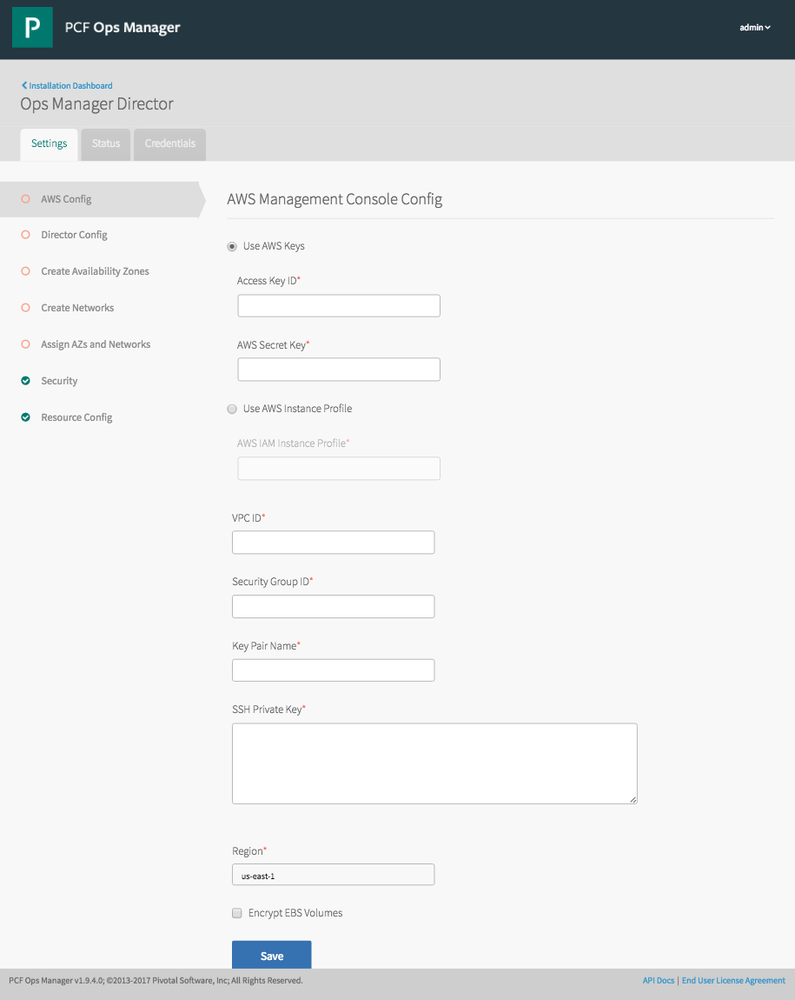
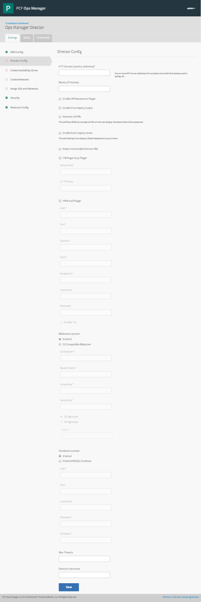
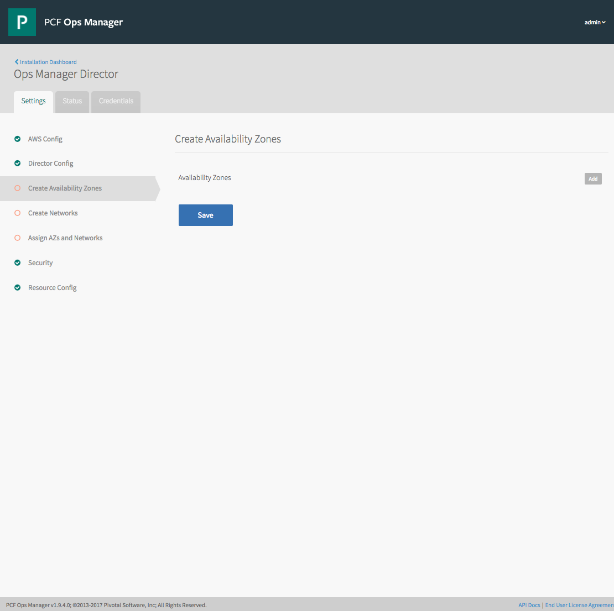
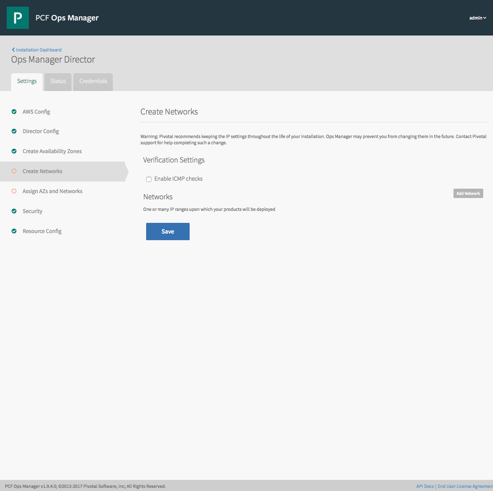
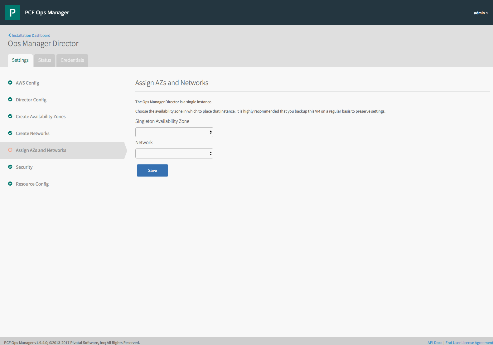
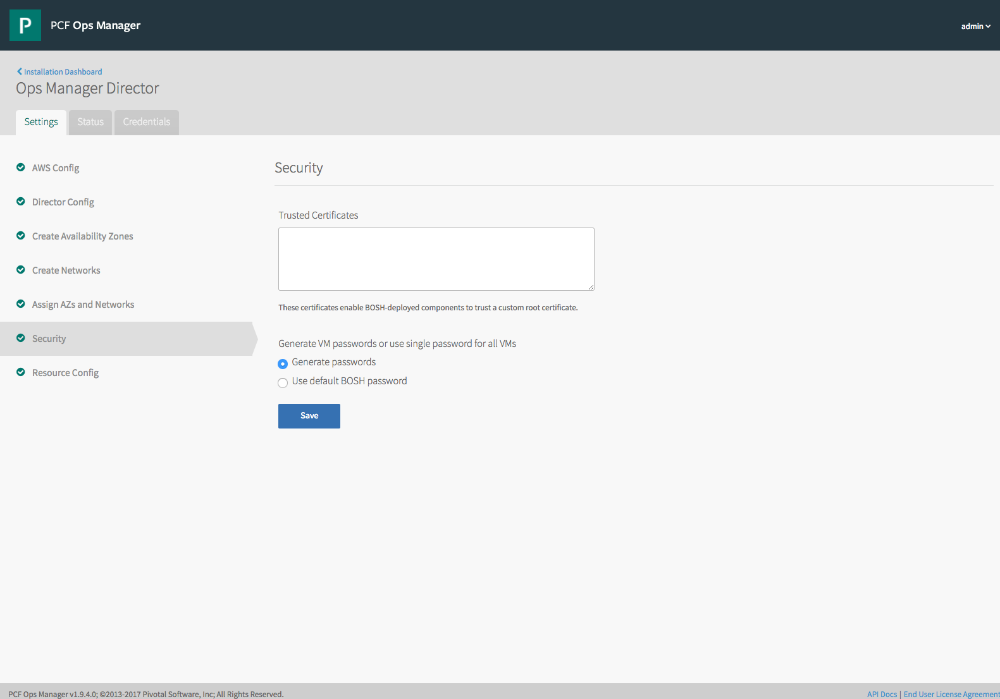
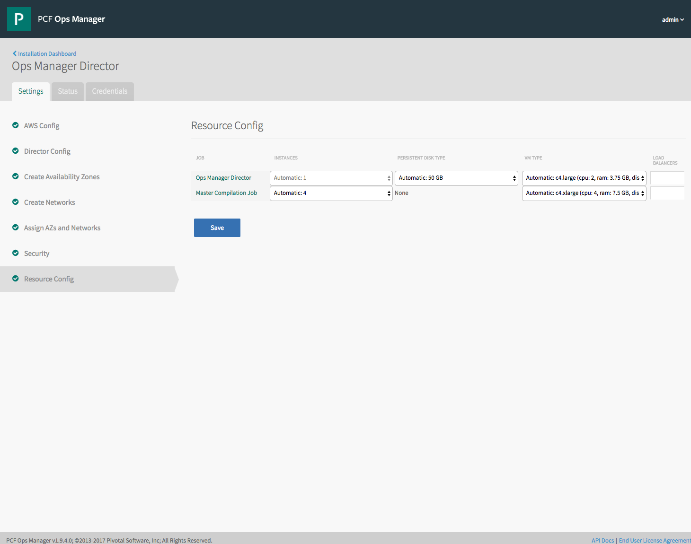

In this directory are a bunch of JSON files to help with automating Ops Manager Director configuration and deployment.

Once you have applied all configurations, kick off the Director deployment with:

```
curl -k "https://localhost/api/v0/installations" \
    -X POST \
    -H "Authorization: Bearer $UAA_ACCESS_TOKEN" \
    -H "Content-Type: application/json"
    -d '{"errands": {} }'
```

You'll get back something like `{"install":{"id":1}}`, which you can then poll for `succeeded` or `failed` with:

```
curl -k "https://localhost/api/v0/installations/:id" \
    -H "Authorization: Bearer $UAA_ACCESS_TOKEN" \
```

**Examples**

Note that these all assume you are running `curl` from the Ops Manager VM.

- Automate 'AWS Config' page

**NOTE** The `ssh_private_key` value must be a single line, with `\n` in place of all newline characters in the original key file.



```
curl -k "https://localhost/api/v0/staged/director/properties" \
    -X PUT \
    -H "Authorization: Bearer $UAA_ACCESS_TOKEN" \
    -H "Content-Type: application/json" \
    -d @director-iaas-configuration.json
```

- Automate 'Director Config' page



```
curl -k "https://localhost/api/v0/staged/director/properties" \
    -X PUT \
    -H "Authorization: Bearer $UAA_ACCESS_TOKEN" \
    -H "Content-Type: application/json" \
    -d @director-configuration.json
```

- Automate 'Create Availability Zones' page



```
curl -k "https://localhost/api/v0/staged/director/availability_zones" \
    -X PUT \
    -H "Authorization: Bearer UAA_ACCESS_TOKEN" \
    -H "Content-Type: application/json" \
    -d @director-az-configuration.json
```

- Automate 'Create Networks' page



```
curl -k "https://localhost/api/v0/staged/director/networks" \
    -X PUT \
    -H "Authorization: Bearer UAA_ACCESS_TOKEN" \
    -H "Content-Type: application/json" \
    -d @director-networks-configuration.json
```

- Automate 'Assign AZs and Networks' page



```
curl -k "https://localhost/api/v0/staged/director/network_and_az" \
    -X PUT \
    -H "Authorization: Bearer UAA_ACCESS_TOKEN" \
    -H "Content-Type: application/json" \
    -d @director-network-az-configuration.json
```

- Automate 'Security' page



```
curl -k "https://localhost/api/v0/staged/director/properties" \
    -X PUT \
    -H "Authorization: Bearer UAA_ACCESS_TOKEN" \
    -H "Content-Type: application/json" \
    -d @director-security-configuration.json
```

- Automate 'Resource Config' page



`Sorry, you're outta luck`
